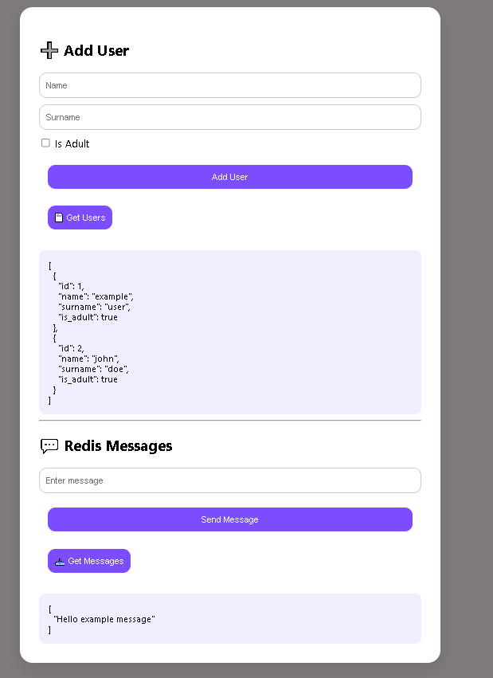
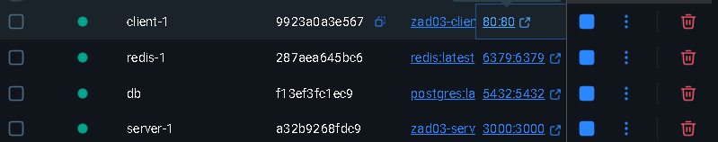

# Full Stack Docker Compose Project

This repository contains three applications, each using Docker Compose to run services. These applications are simple and serve as a learning tool for Docker, Node.js, Flask, Redis, PostgreSQL, and full-stack development.

## Applications Overview

### 1. **simpleFlaskApp**

A basic Flask application running inside a Docker container. The app exposes a simple HTTP route that returns a message: "Hello from Flask in Docker!".

#### How to run:

1. Navigate to the project directory.
2. Run the following command to start the application:

   ```docker compose up```

3. Visit `http://localhost:8080` in your browser to see the output.

### 2. **simpleNodeRedisApp**

A simple Node.js application using Redis for message storage. It provides endpoints to post messages and retrieve them.

#### How to run:

1. Navigate to the project directory.
2. Run the following command to start the application:

   ```docker compose up```

3. You can interact with the app by accessing the following routes:
   - `POST /message` - Add a message to Redis.
   - `GET /messages` - Retrieve all messages from Redis.

### 3. **FullStackDockerComposeApp**

A full-stack application using Docker Compose to connect a client, server, Redis, and PostgreSQL. This app allows you to:
- Add users to a database.
- Retrieve users from the database.
- Add and retrieve messages stored in Redis.

#### Application Structure:

- **Client**: The front-end built with HTML, CSS, and JavaScript, served through Nginx.
- **Server**: The back-end is a Node.js application that interacts with Redis and PostgreSQL.
- **Redis**: Used for storing messages.
- **PostgreSQL**: Used for storing user information.

#### How to run:

1. Navigate to the project directory.
2. Run the following command to start the full-stack application:

   ```docker compose up```

3. The application will be available at `http://localhost:80`.

4. Interact with the app:
   - Add users using the form and view them in the list.
   - Send and view messages using the Redis functionality.

#### Client Interface:

Here is a screenshot of the client interface:



#### Docker Desktop View:

Here is how the application looks in Docker Desktop:



## Docker Compose Configuration

Each application requires Docker Compose to run. The `docker-compose.yml` files provided in the project root directory will handle all the necessary configuration for building and running the services.

#### How to use Docker Compose:

To run any of the applications, navigate to the project directory and execute:

```docker compose up```

This command will:
- Build and start the containers.
- Expose necessary ports to interact with the application.
- Set up the services according to the configuration specified in the `docker-compose.yml` files.

## Conclusion

This repository showcases three simple applications integrated with Docker. The full-stack app highlights how to combine various technologies like Redis, PostgreSQL, and Docker to create a complete web application. All apps are easy to run using Docker Compose and can serve as a great starting point for building more complex systems.

Feel free to explore the code, experiment with Docker, and adapt the applications to your own
